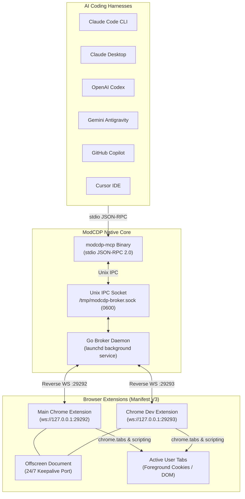

# ModCDP-MCP ⚡

[](https://github.com/le-dawg/modcdp-mcp/actions/workflows/ci.yml)
[](https://github.com/le-dawg/modcdp-mcp/releases/tag/v0.2.0)
[](https://opensource.org/licenses/MIT)
[](https://golang.org)
[](https://modelcontextprotocol.io)
[](https://github.com/le-dawg/modcdp-mcp/actions)
[](https://github.com/le-dawg/modcdp-mcp)

> **Native Dual-Browser Model Context Protocol (MCP) Server for Google Chrome & Chrome Dev.**  
> Bypass Chrome 136/144+ remote debugging consent dialogs with zero modal fatigue, instant foreground tab targeting, and full DOM/extension execution across all AI coding harnesses.

---

## 🎯 The Problem Solved

Starting in **Google Chrome 136/144+**, traditional Chrome DevTools Protocol (CDP) workflows that rely on `--remote-debugging-port=9222` trigger an intrusive, system-level modal consent dialog (*"Allow remote debugging for this browser instance?"*) on every connection attempt.

### Why Autonomous AI Agents Break
When autonomous AI agent harnesses—such as **Claude Code**, **OpenAI Codex CLI**, **Gemini Antigravity**, **GitHub Copilot**, or **Cursor**—execute multi-turn loops:
1. **Agent Loops Stall**: Inbound connections to port 9222 trigger an OS modal dialog. The AI agent loop blocks indefinitely waiting for a human click that never arrives if the developer is away, hanging test pipelines and unattended workflows.
2. **Detached Profiles Blind the Agent**: Workarounds that launch a fresh temporary profile (`--user-data-dir=/tmp/...`) eliminate your logged-in cookies, active sessions, and open tabs. The agent is rendered completely blind to the actual web page you are viewing.
3. **Focus Ambiguity**: Traditional CDP tools cannot reliably identify which tab is visually focused in the foreground, often querying stale background tabs.

### The ModCDP Inverted Architecture Solution
`modcdp-mcp` solves this fundamentally by **inverting the connection topology**:

- **No Open Debug Ports**: Google Chrome is never launched with `--remote-debugging-port`.
- **Outbound Reverse WebSocket**: An unpacked Manifest V3 extension initiates an *outbound* WebSocket connection to a lightweight local Go broker (`127.0.0.1:29292` / `29293`).
- **Zero Modal Dialogs**: Chrome treats outbound localhost connections from installed extensions as trusted internal extension traffic—triggering **zero consent prompts**.
- **User Session Continuity**: High-privilege extension APIs (`chrome.tabs`, `chrome.scripting`, `chrome.offscreen`) operate directly on your live, authenticated browser tabs with complete session cookies and local storage intact.

---

## 🏛️ System Architecture

### Mermaid Diagram


### ASCII Data Flow
```
┌────────────────────────────────────────────────────────┐
│ AI Coding Agent (Claude Code / Codex / Antigravity)    │
└───────────────────────────┬────────────────────────────┘
                            │ Standard stdio (MCP JSON-RPC 2.0)
                            ▼
┌────────────────────────────────────────────────────────┐
│ Native MCP Server CLI (~/.local/bin/modcdp-mcp)        │
└───────────────────────────┬────────────────────────────┘
                            │ Unix Domain Socket IPC (/tmp/modcdp-broker.sock)
                            ▼
┌────────────────────────────────────────────────────────┐
│ Go Broker Daemon (launchd persistent service)          │
│  ├─ Dual-Browser Multiplexer (Main :29292 / Dev :29293)│
│  ├─ Monotonic Session Nonce Guard & Heartbeat Eviction │
└──────────────┬──────────────────────────┬──────────────┘
               │ Reverse WS (:29292)      │ Reverse WS (:29293)
               ▼                          ▼
┌──────────────────────────────┐ ┌──────────────────────────────┐
│ Main Chrome Extension (MV3)  │ │ Chrome Dev Extension (MV3)   │
│  ├─ Service Worker           │ │  ├─ Service Worker           │
│  ├─ Offscreen Keepalive      │ │  ├─ Offscreen Keepalive      │
│  └─ Active User Tabs         │ │  └─ Active Dev Tabs          │
└──────────────────────────────┘ └──────────────────────────────┘
```

---

## 📊 Feature Comparison Matrix

| Feature | ModCDP-MCP ⚡ | Standard CDP (`:9222`) | Puppeteer / Playwright | Chrome DevTools MCP |
|---|:---:|:---:|:---:|:---:|
| **Zero Modal Prompts (Chrome 136/144+)** | ✅ **Yes (Zero prompts)** | ❌ Spams modal prompts | ❌ Requires clean profile | ❌ Spams modal prompts |
| **Inspects User's Live Session (Auth/Cookies)** | ✅ **Yes (Foreground session)** | ⚠️ Unreliable / resets auth | ❌ Detached empty profile | ❌ Isolated instance |
| **Dual-Browser Multiplexing (Main & Dev)** | ✅ **Yes (Ports 29292 & 29293)** | ❌ Single port only | ❌ Single browser instance | ❌ Single browser instance |
| **Active Foreground Tab Targeting** | ✅ **Yes (`get_active_tab`)** | ❌ Blind to visual focus | ❌ No active window concept | ❌ Manual tab indexing |
| **Protocol & Transport** | ✅ **Native MCP (stdio JSON-RPC)**| ❌ Raw WebSocket protocol | ❌ High-level Node library | ⚠️ Node wrapper process |
| **Memory & Binary Footprint** | ✅ **~15MB Go binary** | ⚠️ Full Chromium process | ❌ Heavy Node/Chromium runtime (~300MB) | ❌ Node.js runtime (~150MB) |
| **Startup Latency** | ✅ **< 5ms** | ⚠️ 500ms – 2,000ms | ❌ 1,000ms – 3,000ms | ❌ 800ms – 2,500ms |
| **Autonomous Agent Loop Resilience** | ✅ **100% Non-blocking** | ❌ Stalls on user prompt | ❌ Stalls or hangs | ❌ Stalls on user prompt |

---

## 🚀 60-Second Quickstart

### Option A: One-Line Installer (Recommended)
Download the latest pre-compiled release binary and initialize extensions with a single command:
```bash
curl -fsSL https://raw.githubusercontent.com/le-dawg/modcdp-mcp/main/scripts/install.sh | bash
```

### Option B: Build from Source (`npm run onboard`)
```bash
git clone https://github.com/le-dawg/modcdp-mcp.git
cd modcdp-mcp
npm install
npm run onboard
```

The interactive onboarding script (`scripts/onboard.mjs`):
1. Compiles the native Go binary to `~/.local/bin/modcdp-mcp`.
2. Builds the dual unpacked extensions into `~/.config/modcdp-mcp/extensions/`.
3. Configures and starts the background broker daemon via macOS `launchd` (`~/Library/LaunchAgents/com.dawgctor.modcdp-broker.plist`).
4. Automatically detects and registers `modcdp-mcp` across your installed AI agent harnesses with rollback backups.

---

### Loading the Unpacked Extensions in Chrome

1. Open **Google Chrome** and navigate to `chrome://extensions`.
2. Enable **Developer mode** via the toggle in the top-right corner.
3. Click **Load unpacked** (top-left) and select:
   - `~/.config/modcdp-mcp/extensions/main` (Main Chrome)
   - `~/.config/modcdp-mcp/extensions/dev` (Chrome Dev / Canary, optional)
4. The ModCDP extension icon will appear in your toolbar. It automatically connects outbound to the background broker daemon.

---

## 🛠️ MCP Tools Reference & Schemas

`modcdp-mcp` provides 6 focused, high-performance tools for browser automation:

### 1. `get_active_tab`
Returns the currently focused browser tab in the user's active Chrome window.

**Parameters**:
| Name | Type | Required | Default | Description |
|---|---|:---:|:---:|---|
| `browser` | string | No | `"any"` | Target browser: `"main"`, `"dev"`, or `"any"` (prefers active). |

**Example Request**:
```json
{
  "name": "get_active_tab",
  "arguments": {
    "browser": "any"
  }
}
```

**Example Response**:
```json
{
  "id": 14201,
  "title": "GitHub — le-dawg/modcdp-mcp: Native Dual-Browser MCP Server",
  "url": "https://github.com/le-dawg/modcdp-mcp",
  "windowId": 801,
  "active": true
}
```

---

### 2. `find_tabs_by_title`
Searches open browser tabs across all windows by title regular expression or substring, with optional URL filtering.

**Parameters**:
| Name | Type | Required | Default | Description |
|---|---|:---:|:---:|---|
| `title_pattern` | string | **Yes** | — | Regex or case-insensitive substring to match against tab titles. |
| `url_pattern` | string | No | `""` | Optional substring to filter tab URLs. |
| `browser` | string | No | `"any"` | Target browser: `"main"`, `"dev"`, or `"any"`. |

**Example Request**:
```json
{
  "name": "find_tabs_by_title",
  "arguments": {
    "title_pattern": "GitHub PR",
    "url_pattern": "github.com",
    "browser": "main"
  }
}
```

**Example Response**:
```json
[
  {
    "id": 14205,
    "title": "GitHub PR #42 — S-Tier Open Source Overhaul",
    "url": "https://github.com/le-dawg/modcdp-mcp/pull/42",
    "windowId": 801,
    "active": false
  }
]
```

---

### 3. `focus_tab`
Brings a specific browser tab and its containing Chrome window to the visual foreground.

**Parameters**:
| Name | Type | Required | Default | Description |
|---|---|:---:|:---:|---|
| `tab_id` | number | **Yes** | — | The numeric Chrome tab ID to bring to front. |
| `browser` | string | No | `"any"` | Target browser: `"main"`, `"dev"`, or `"any"`. |

**Example Request**:
```json
{
  "name": "focus_tab",
  "arguments": {
    "tab_id": 14205,
    "browser": "main"
  }
}
```

**Example Response**:
```json
{
  "focused": true,
  "tab_id": 14205,
  "title": "GitHub PR #42 — S-Tier Open Source Overhaul",
  "url": "https://github.com/le-dawg/modcdp-mcp/pull/42"
}
```

---

### 4. `eval_in_tab`
Evaluates a JavaScript expression directly within the DOM execution context of a specific tab.

**Parameters**:
| Name | Type | Required | Default | Description |
|---|---|:---:|:---:|---|
| `tab_id` | number | **Yes** | — | The numeric Chrome tab ID. |
| `expression` | string | **Yes** | — | JavaScript code to execute within the page DOM. |
| `browser` | string | No | `"any"` | Target browser: `"main"`, `"dev"`, or `"any"`. |

**Example Request**:
```json
{
  "name": "eval_in_tab",
  "arguments": {
    "tab_id": 14201,
    "expression": "document.querySelector('h1').innerText",
    "browser": "main"
  }
}
```

**Example Response**:
```json
"ModCDP-MCP ⚡"
```

---

### 5. `modcdp_eval`
Evaluates JavaScript directly in the extension service worker context with full access to high-privilege `chrome.*` APIs (`chrome.tabs`, `chrome.windows`, `chrome.cookies`, `chrome.storage`).

**Parameters**:
| Name | Type | Required | Default | Description |
|---|---|:---:|:---:|---|
| `expression` | string | **Yes** | — | JavaScript expression to evaluate with `chrome.*` in scope. |
| `browser` | string | No | `"any"` | Target browser: `"main"`, `"dev"`, or `"any"`. |

**Example Request**:
```json
{
  "name": "modcdp_eval",
  "arguments": {
    "expression": "chrome.tabs.query({}).then(tabs => tabs.length)",
    "browser": "main"
  }
}
```

**Example Response**:
```json
18
```

---

### 6. `capture_active_tab_screenshot`
Captures a visual screenshot of the specified tab or currently active foreground tab without stealing window focus or destroying page state.

**Parameters**:
| Name | Type | Required | Default | Description |
|---|---|:---:|:---:|---|
| `tab_id` | number | No | `null` | Optional tab ID. If omitted, captures currently focused tab. |
| `format` | string | No | `"png"` | Image format: `"png"` or `"jpeg"`. |
| `browser` | string | No | `"any"` | Target browser: `"main"`, `"dev"`, or `"any"`. |

**Example Request**:
```json
{
  "name": "capture_active_tab_screenshot",
  "arguments": {
    "format": "png",
    "browser": "any"
  }
}
```

**Example Response**:
```json
{
  "type": "image",
  "mimeType": "image/png",
  "data": "iVBORw0KGgoAAAANSUhEUgAA..."
}
```

---

## ⚙️ AI Harness Configuration

Running `npm run onboard` configures all installed harnesses automatically. If configuring manually, use the following snippets:

<details>
<summary><b>Anthropic Claude Code (<code>~/.claude.json</code>)</b></summary>

```json
{
  "mcpServers": {
    "modcdp": {
      "command": "/Users/YOUR_USER/.local/bin/modcdp-mcp",
      "args": [],
      "env": {}
    }
  }
}
```
</details>

<details>
<summary><b>Claude Desktop (<code>claude_desktop_config.json</code>)</b></summary>

*Location: `~/Library/Application Support/Claude/claude_desktop_config.json` on macOS*

```json
{
  "mcpServers": {
    "modcdp": {
      "command": "/Users/YOUR_USER/.local/bin/modcdp-mcp",
      "args": [],
      "env": {}
    }
  }
}
```
</details>

<details>
<summary><b>OpenAI Codex (<code>~/.codex/config.toml</code>)</b></summary>

```toml
[mcp_servers.modcdp]
command = "/Users/YOUR_USER/.local/bin/modcdp-mcp"
args = []
enabled = true
```
</details>

<details>
<summary><b>Google Gemini / Antigravity CLI (<code>~/.gemini/antigravity-cli/mcp_config.json</code>)</b></summary>

```json
{
  "mcpServers": {
    "modcdp": {
      "command": "/Users/YOUR_USER/.local/bin/modcdp-mcp",
      "args": [],
      "env": {}
    }
  }
}
```
</details>

<details>
<summary><b>GitHub Copilot (<code>~/.copilot/mcp-config.json</code>)</b></summary>

```json
{
  "mcpServers": {
    "modcdp": {
      "command": "/Users/YOUR_USER/.local/bin/modcdp-mcp",
      "args": [],
      "env": {}
    }
  }
}
```
</details>

<details>
<summary><b>Cursor IDE (<code>~/.cursor/mcp.json</code> or <code>.cursor/mcp.json</code>)</b></summary>

```json
{
  "mcpServers": {
    "modcdp": {
      "command": "/Users/YOUR_USER/.local/bin/modcdp-mcp",
      "args": [],
      "env": {}
    }
  }
}
```
</details>

---

## 🔧 Troubleshooting & Operational FAQ

### 1. How do I verify the background broker is running?
Check active listening ports:
```bash
lsof -i :29292 -i :29293
```
You should see `modcdp-mcp` listening on `127.0.0.1:29292` (Main Chrome) and `127.0.0.1:29293` (Chrome Dev).

### 2. How do I manage the background daemon on macOS?
The broker daemon is managed by macOS `launchd`:
```bash
# Check service status
launchctl list | grep modcdp

# Restart broker daemon
launchctl kickstart -k gui/$(id -u)/com.dawgctor.modcdp-broker

# Stop broker daemon
launchctl bootout gui/$(id -u)/com.dawgctor.modcdp-broker

# Start / Enable broker daemon
launchctl bootstrap gui/$(id -u) ~/Library/LaunchAgents/com.dawgctor.modcdp-broker.plist
```

### 3. Why does `eval_in_tab` fail on `chrome://` or Chrome Web Store pages?
Due to Chrome extension security policies, `chrome.scripting.executeScript` cannot execute scripts inside protected system URLs (`chrome://`, `chrome-extension://`, `devtools://`, or the Chrome Web Store). This is a browser security constraint. If your active tab is on one of these pages, navigate to an HTTP/HTTPS URL or use `modcdp_eval` to query tab metadata via `chrome.tabs`.

### 4. What if the extension disconnects after system sleep?
The extension includes a 24/7 offscreen keepalive document (`pages/offscreen_keepalive.html`) and automatically reconnects with exponential backoff if the broker restarts. If you ever need to manually force a reconnect, navigate to `chrome://extensions` and click the reload button on the ModCDP extension.

### 5. Multi-user socket permissions
The Unix domain socket is created at `/tmp/modcdp-broker.sock` with restrictive `0600` permissions. If switching between different local macOS user accounts, ensure the previous user's socket is cleared or run the broker under your own user session.

---

## 🧪 Testing

```bash
# Run Go broker and protocol unit tests (5 tests)
go test ./... -v

# Run full integration and build verification suite (23 tests)
npm test
```

See [CONTRIBUTING.md](CONTRIBUTING.md) for detailed guidelines on running tests in isolated environments.

---

## 📄 License & Community

- **License**: [MIT](LICENSE) © 2026 [le-dawg](https://github.com/le-dawg)
- **Code of Conduct**: [Contributor Covenant v2.1](CODE_OF_CONDUCT.md)
- **Security Policy**: [Vulnerability Reporting & Threat Model](SECURITY.md)
